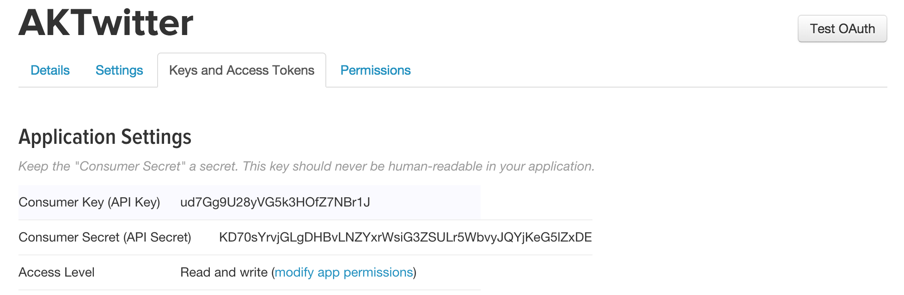

## Twitter Redux

Time spent: `<Number of hours spent>`

### Features

#### Required

- [x] Hamburger menu
   - [x] Dragging anywhere in the view should reveal the menu.
   - [x] The menu should include links to your profile, the home timeline, and the mentions view.
   - [x] The menu can look similar to the LinkedIn menu below or feel free to take liberty with the UI.
- [x] Profile page
   - [x] Contains the user header view
   - [x] Contains a section with the users basic stats: # tweets, # following, # followers
- [x] Home Timeline
   - [x] Tapping on a user image should bring up that user's profile page

#### Optional

- [x] Profile Page
   - [x] Optional: Implement the paging view for the user description.
   - [x] Optional: As the paging view moves, increase the opacity of the background screen. See the actual Twitter app for this effect
   - [x] Optional: Pulling down the profile page should blur and resize the header image.
- [x] Optional: Account switching
   - [x] Long press on tab bar to bring up Account view with animation
   - [x] Tap account to switch to
   - [x] Include a plus button to Add an Account
   - [x] Swipe to delete an account

### Walkthrough

GIF created with [LiceCap](http://www.cockos.com/licecap/).

#### Installation setup instructions

* For app to work properly, you need to provide a valid Twitter application <b>Consumer Key</b> and <b>Consmer Secret</b> to the app. They can be created by going to [Application Management Console](https://apps.twitter.com) and clicking <b>Create New App</b>
 * After the creadentails are generated, you can get the credentials from <b>Keys and Access Tokens</b> tab
  
* To add <b>Consumer Key</b> and <b>Consmer Secret</b> to the app, do following:
 * Open [CredentialsInfo.plist](https://github.com/aamays/Twitter/blob/master/Twitter/CredentialsInfo.plist) in Twitter folder
 * Set <b>ConsumerKey</b> key's value to your app's Consumer Key
 * Set <b>ConsumerSecret</b> key's value to your app's Consmer Secret
 * Save the file

#### Development/Testing environment

* Operating System: Yosemite v10.10.4
* Xcode v7.0
* iOS v9.0
* Devices
 * iPhone 6 Simulator
